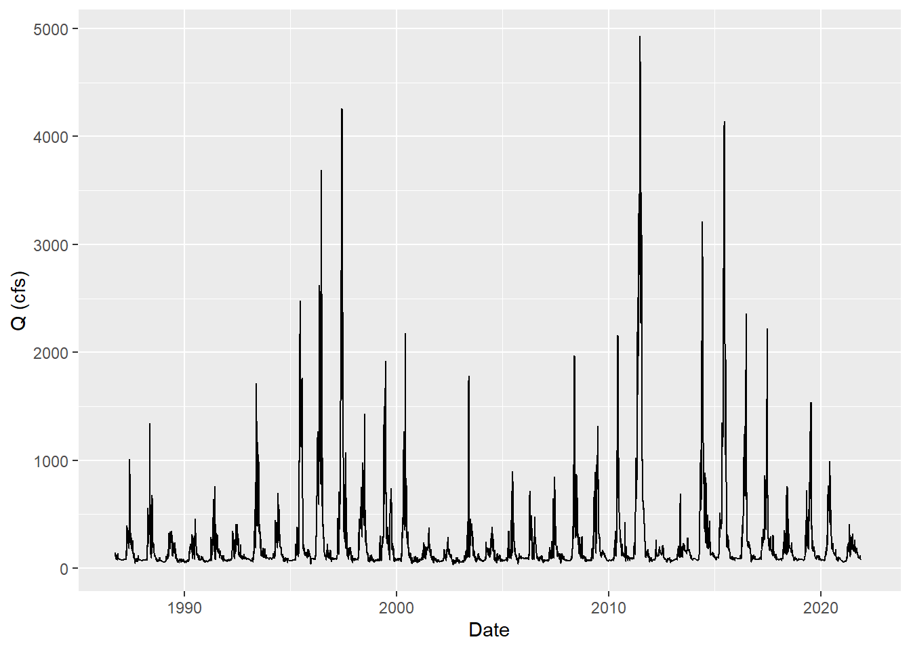

# Introduction 


When wildfires occur, it creates major damages through the entire land and ecosystem of the area. A large part of the ecosystem that is affected is the watershed of the area. When a wildfire burns through the area it creates long-term affects that can alter the streamflow and water quality of that watershed. These wildfires were once a common natural occurrence in most forest ecosystems that did not have a devastating effect on the land. But in more recent years things such as climate change, fuel load accumulation, extensive droughts, and an increase in human presence in forests has caused a devastating effect on the land when these wildfires burn. The concern that comes from these factors has put a heavier strain on the understanding on how the landscape changes and reacts to the wildfire. There is a need to understand the interaction between wildfire, and associated responses in vegetation cover, and hydrologic and geomorphic behavior. [@owens_muted_2013]

When a wildfire burns it way through the land it often causes dramatic changes in forest vegetation structure and soil conditions, it also alters the watershed processes that control streamflow, soil erosion, nutrient export, and downstream water chemistry [@hohner_wildfires_2019]. The effect of erosion, infiltration, runoff, and slope failure play a major role in how the land is re-molded. These changes can include the streamflow, landscape, and the soil of the land. When a forest is undisturbed its soils have relatively high infiltration rates that helps to control runoff effects. Wildfires can reduce infiltration by exposing mineral soil to rain drop impact and splash that can seal soil pores at the surface [@ice_effects_nodate]. The effect that comes from the wildfire then causes dramatic changes in both annual and peak streamflows. The wildfires remove features from the land that shows decreased infiltration rates and increased runoff rates. As seen with high-severity fires heat the mineral soil and consume all vegetative ground cover, leaving only ash at the soil surface [@kunze_streamflow_2006]. With the features burned away from the land it decreases infiltration and increases runoff creating a negative effect to streamflow and water quality. Reduced infiltration then promotes overland flow, surface erosion, runoff, and sediment that contributes to debris and extreme channel impacts that affect streamflow. These effects from a wildfire creates a domino effect that starts with the forest ecosystem and begins to alter the land and watershed from the most obvious to the least observed occurrences. 

After the wildfire causes changes to the watersheds soil and hydrologic system it then leads to further effects on the land and water quality. Sediment load, flooding, runoff, and erosion create new factors to consider. These large erosion events, such as those caused by wildfire, are short-lived on geological time scales, but can dominate the long-term sediment yield response[@murphy_effects_nodate]. This is an important factor to consider because of the water quality of the watershed. The mineralization of organic matter, interruption of root uptake, and loss of shade can further impact water quality by increasing stream temperatures and nutrient concentrations [@ice_effects_nodate]. Most water quality issues that occur in each watershed is seen after the wildfire is out. The postfire effects that is seen on the water quality has to do with water surface composition and the drinking water treatment. Once down-stream the water quality effects is better seen at water treatment plants and what needs to be done now to purify the water that was affected by postfire conditions. Extreme postfire erosion can damage infrastructure, accumulate in reservoirs, and challenge coagulation, filtration, and solids handling processes [@hohner_wildfires_2019]. With all these factors occurring it causes these water treatment facilities to adapt to these new quality features so that the people dependent on that water source can still use the water source. Changes in the quantity and composition of dissolved organic matter (DOM) exported from burned watersheds can influence treatment process performance and the formation of disinfection byproducts (DBPs) [@hohner_wildfires_2019]. This is important to understand to see the effects the wildfire has on the water quality. Here it is seen that even after the fire is out it does not mean the effects of the fire is gone. 
  
In the state of Colorado warmer spring air temperatures and longer wildfire seasons in the western US [@mast_water-quality_2016] had created the land for larger and longer wildfire season. This increase has created concern for larger fires to appear across Colorado's Front Range. With the possibility of even larger fires to occur it creates instability in the land once the fire burn through it, which creates alterations to the watersheds associated with the fire. Postfire the largest change in the land is the increase in runoff and erosion. The effects that come from runoff and erosion has pushed for efforts to better understand wildfires in the Colorado Front Range and effects it has on the soil and water quality. An example of a wildfire that has affected a watershed was that of the East Troublesome Fire that occurred the afternoon of October 14, 2020. Fire behavior played a large role in the severity of impacts to soil in the East Troublesome fire [@us_national_forest_east_2020]. The fire also altered the watershed of this area due to the location of this wildfire. The fire burned at a high elevation which is composed of a dominated snowmelt watershed attached to the Upper Colorado River. The watershed response within the burned area will likely include an initial flush of ash, rill, and gully erosion in headwater drainages and on steep slopes, areas with snowmelt peak flows elevated over 50% relative to pre-fire, sediment-laden flash floods following high-intensity rain events, and potentially debris flows [@us_national_forest_east_2020]. This effect on the watershed can affect the soil, land, and water quality. The streamflow is also highly affected by such a fire due to the debris that fall into the streams. Debris flows are among the most hazardous consequences of rainfall on burned hillslopes [@us_national_forest_east_2020]. These kinds of debris can affect the streamflow and effect the watershed overall. This study will be looking more into the East Troublesome Fire and the effects, it has had on the streamflow and water quality of the watershed.

<!--chapter:end:index.Rmd-->


# Methods

Downloaded data from USGS site number 09014050 that is at the Grand lake outlet that was affected by the East Troublesome Fire.
Downloaded data from USGS site number 09034250 that is along troublesome creek and the Colorado river that was affected by the East Troublesome Fire.
Downloaded data from USGS site number 09040500 that is along the Colorado River that was affected by the East Troublesome Fire.


## USGS Sites


```r
site_no <- "09034250" 
site_no2 <- "09040500"
site_no3 <- "09014050"
```

## Downloaded Discharge Data


```r
# Discharge data pulled form the site from 10/01/1986 to 1/1/2022
q <- readNWISdv(siteNumbers = site_no,
                parameterCd = '00060',
                startDate = '1986-10-01',
                endDate = '2022-01-01') %>%
  rename(q_cfs = X_00060_00003) %>%
  addWaterYear(.) %>%
  select(-agency_cd, -X_00060_00003_cd)
```


### Mean Monthly Discharge 

```r
q_month_means <- q%>%
  mutate(month = month(Date),
         year = year(Date))%>%
  group_by(year, month)%>%
  summarize(q_mean = mean(q_cfs, na.rm=T))
```

```
## `summarise()` has grouped output by 'year'. You can override using the
## `.groups` argument.
```

### Min Monthly Discharge 

```r
q_month_mins <- q%>%
  mutate(month = month(Date),
         year = year(Date))%>%
  group_by(year, month)%>%
  summarize(q_min = min(q_cfs))
```

```
## `summarise()` has grouped output by 'year'. You can override using the
## `.groups` argument.
```

### Median Monthly Discharge 

```r
q_month_medians <- q%>%
  mutate(month = month(Date),
         year = year(Date))%>%
  group_by(year, month)%>%
  summarize(q_median = median(q_cfs))
```

```
## `summarise()` has grouped output by 'year'. You can override using the
## `.groups` argument.
```

## Specific Conductance Data


```r
# Specific conductance data pulled from the sites from 10/01/1986 to 1/1/2022

sc <- readNWISdv(siteNumbers = site_no,
                parameterCd = '00095',
                startDate = '1986-10-01', 
                endDate = '2021-09-30')%>%
  rename(sc_uscm = X_00095_00003)


sc2 <- readNWISdv(siteNumbers = site_no2,
                parameterCd = '00095',
                startDate = '1986-10-01', 
                endDate = '2021-09-30')%>%
  rename(sc_uscm = X_00095_00003)
 
  

sc3 <- readNWISdv(siteNumbers = site_no3,
                parameterCd = '00095', 
                startDate = '1986-10-01', 
                endDate = '2022-01-01')%>%
  rename(sc_uscm = X_00095_00003)%>%
  addWaterYear(.) %>%
  select(-agency_cd, -X_00095_00003_cd)
```

### Mean Monthly Data


```r
sc_month_means <- sc%>%
  mutate(month = month(Date),
         year = year(Date))%>%
  group_by(year, month)%>%
  summarize(sc_mean = mean(sc_uscm, na.rm=T))
```

```
## `summarise()` has grouped output by 'year'. You can override using the
## `.groups` argument.
```

```r
sc2_month_means <- sc2%>%
  mutate(month = month(Date),
         year = year(Date))%>%
  group_by(year, month)%>%
  summarize(sc2_mean = mean(sc_uscm, na.rm=T))
```

```
## `summarise()` has grouped output by 'year'. You can override using the
## `.groups` argument.
```

```r
sc3_month_means <- sc3%>%
  mutate(month = month(Date),
         year = year(Date))%>%
  group_by(year, month)%>%
  summarize(sc3_mean = mean(sc_uscm, na.rm=T))
```

```
## `summarise()` has grouped output by 'year'. You can override using the
## `.groups` argument.
```

### Min Monthly Data


```r
sc_month_min <- sc%>%
  mutate(month = month(Date),
         year = year(Date))%>%
  group_by(year, month)%>%
  summarize(sc_min = min(sc_uscm, na.rm=T))
```

```
## `summarise()` has grouped output by 'year'. You can override using the
## `.groups` argument.
```

```r
sc2_month_min <- sc2%>%
  mutate(month = month(Date),
         year = year(Date))%>%
  group_by(year, month)%>%
  summarize(sc2_min = min(sc_uscm, na.rm=T))
```

```
## `summarise()` has grouped output by 'year'. You can override using the
## `.groups` argument.
```

```r
sc3_month_min <- sc3%>%
  mutate(month = month(Date),
         year = year(Date))%>%
  group_by(year, month)%>%
  summarize(sc3_min = min(sc_uscm, na.rm=T))
```

```
## `summarise()` has grouped output by 'year'. You can override using the
## `.groups` argument.
```

### Median Monthly Data


```r
sc_month_median <- sc%>%
  mutate(month = month(Date),
         year = year(Date))%>%
  group_by(year, month)%>%
  summarize(sc_median = median(sc_uscm, na.rm=T))
```

```
## `summarise()` has grouped output by 'year'. You can override using the
## `.groups` argument.
```

```r
sc2_month_median <- sc2%>%
  mutate(month = month(Date),
         year = year(Date))%>%
  group_by(year, month)%>%
  summarize(sc2_median = median(sc_uscm, na.rm=T))
```

```
## `summarise()` has grouped output by 'year'. You can override using the
## `.groups` argument.
```

```r
sc3_month_median <- sc3%>%
  mutate(month = month(Date),
         year = year(Date))%>%
  group_by(year, month)%>%
  summarize(sc3_median = median(sc_uscm, na.rm=T))
```

```
## `summarise()` has grouped output by 'year'. You can override using the
## `.groups` argument.
```

## Site Discription

USGS 09014050 GRAND LAKE OUTLET BLW CHIPMUNK LN AT GRAND LK, CO
USGS site 09034250 COLORADO RIVER AT WINDY GAP, NEAR GRANBY, CO.
USGS 09040500 TROUBLESOME CREEK NEAR TROUBLESOME, CO.

### Deliniated Watershed

```r
watershed <- st_read('Granby.geojson')%>%
  dplyr::filter(id=='globalwatershed')
```

```
## Reading layer `Granby' from data source 
##   `C:\Rstudio\WR 440\GIT\watershed_wildfires\Granby.geojson' 
##   using driver `GeoJSON'
## Simple feature collection with 2 features and 1 field
## Geometry type: GEOMETRY
## Dimension:     XY
## Bounding box:  xmin: -106.1475 ymin: 39.78574 xmax: -105.6262 ymax: 40.48617
## Geodetic CRS:  WGS 84
```

```r
mapview(watershed)
```

```{=html}
<div id="htmlwidget-a2c9d3aeae4657c0cb3b" style="width:672px;height:480px;" class="leaflet html-widget"></div>
<script type="application/json" data-for="htmlwidget-a2c9d3aeae4657c0cb3b">{"x":{"options":{"minZoom":1,"maxZoom":52,"crs":{"crsClass":"L.CRS.EPSG3857","code":null,"proj4def":null,"projectedBounds":null,"options":{}},"preferCanvas":false,"bounceAtZoomLimits":false,"maxBounds":[[[-90,-370]],[[90,370]]]},"calls":[{"method":"addProviderTiles","args":["CartoDB.Positron","CartoDB.Positron","CartoDB.Positron",{"errorTileUrl":"","noWrap":false,"detectRetina":false,"pane":"tilePane"}]},{"method":"addProviderTiles","args":["CartoDB.DarkMatter","CartoDB.DarkMatter","CartoDB.DarkMatter",{"errorTileUrl":"","noWrap":false,"detectRetina":false,"pane":"tilePane"}]},{"method":"addProviderTiles","args":["OpenStreetMap","OpenStreetMap","OpenStreetMap",{"errorTileUrl":"","noWrap":false,"detectRetina":false,"pane":"tilePane"}]},{"method":"addProviderTiles","args":["Esri.WorldImagery","Esri.WorldImagery","Esri.WorldImagery",{"errorTileUrl":"","noWrap":false,"detectRetina":false,"pane":"tilePane"}]},{"method":"addProviderTiles","args":["OpenTopoMap","OpenTopoMap","OpenTopoMap",{"errorTileUrl":"","noWrap":false,"detectRetina":false,"pane":"tilePane"}]},{"method":"createMapPane","args":["polygon",420]},{"method":"addFlatGeoBuf","args":["watershed","watershed",null,true,"globalwatershed",{"radius":6,"stroke":true,"color":"#333333","weight":0.5,"opacity":0.9,"fill":true,"fillColor":"#6666FF","fillOpacity":0.6},{"className":"","pane":"polygon"},"mapview-popup",{"radius":{"to":[3,15],"from":[3,15]},"weight":{"to":[1,10],"from":[1,10]},"opacity":{"to":[0,1],"from":[0,1]},"fillOpacity":{"to":[0,1],"from":[0,1]}}]},{"method":"addScaleBar","args":[{"maxWidth":100,"metric":true,"imperial":true,"updateWhenIdle":true,"position":"bottomleft"}]},{"method":"addHomeButton","args":[-106.147486181335,39.785738522463,-105.626172677596,40.4861725476823,true,"watershed","Zoom to watershed","<strong> watershed <\/strong>","bottomright"]},{"method":"addLayersControl","args":[["CartoDB.Positron","CartoDB.DarkMatter","OpenStreetMap","Esri.WorldImagery","OpenTopoMap"],"watershed",{"collapsed":true,"autoZIndex":true,"position":"topleft"}]},{"method":"addLegend","args":[{"colors":["#6666FF"],"labels":["globalwatershed"],"na_color":null,"na_label":"NA","opacity":1,"position":"topright","type":"factor","title":"","extra":null,"layerId":null,"className":"info legend","group":"watershed"}]}],"fitBounds":[39.785738522463,-106.147486181335,40.4861725476823,-105.626172677596,[]]},"evals":[],"jsHooks":{"render":[{"code":"function(el, x, data) {\n  return (\n      function(el, x, data) {\n      // get the leaflet map\n      var map = this; //HTMLWidgets.find('#' + el.id);\n      // we need a new div element because we have to handle\n      // the mouseover output separately\n      // debugger;\n      function addElement () {\n      // generate new div Element\n      var newDiv = $(document.createElement('div'));\n      // append at end of leaflet htmlwidget container\n      $(el).append(newDiv);\n      //provide ID and style\n      newDiv.addClass('lnlt');\n      newDiv.css({\n      'position': 'relative',\n      'bottomleft':  '0px',\n      'background-color': 'rgba(255, 255, 255, 0.7)',\n      'box-shadow': '0 0 2px #bbb',\n      'background-clip': 'padding-box',\n      'margin': '0',\n      'padding-left': '5px',\n      'color': '#333',\n      'font': '9px/1.5 \"Helvetica Neue\", Arial, Helvetica, sans-serif',\n      'z-index': '700',\n      });\n      return newDiv;\n      }\n\n\n      // check for already existing lnlt class to not duplicate\n      var lnlt = $(el).find('.lnlt');\n\n      if(!lnlt.length) {\n      lnlt = addElement();\n\n      // grab the special div we generated in the beginning\n      // and put the mousmove output there\n\n      map.on('mousemove', function (e) {\n      if (e.originalEvent.ctrlKey) {\n      if (document.querySelector('.lnlt') === null) lnlt = addElement();\n      lnlt.text(\n                           ' lon: ' + (e.latlng.lng).toFixed(5) +\n                           ' | lat: ' + (e.latlng.lat).toFixed(5) +\n                           ' | zoom: ' + map.getZoom() +\n                           ' | x: ' + L.CRS.EPSG3857.project(e.latlng).x.toFixed(0) +\n                           ' | y: ' + L.CRS.EPSG3857.project(e.latlng).y.toFixed(0) +\n                           ' | epsg: 3857 ' +\n                           ' | proj4: +proj=merc +a=6378137 +b=6378137 +lat_ts=0.0 +lon_0=0.0 +x_0=0.0 +y_0=0 +k=1.0 +units=m +nadgrids=@null +no_defs ');\n      } else {\n      if (document.querySelector('.lnlt') === null) lnlt = addElement();\n      lnlt.text(\n                      ' lon: ' + (e.latlng.lng).toFixed(5) +\n                      ' | lat: ' + (e.latlng.lat).toFixed(5) +\n                      ' | zoom: ' + map.getZoom() + ' ');\n      }\n      });\n\n      // remove the lnlt div when mouse leaves map\n      map.on('mouseout', function (e) {\n      var strip = document.querySelector('.lnlt');\n      if( strip !==null) strip.remove();\n      });\n\n      };\n\n      //$(el).keypress(67, function(e) {\n      map.on('preclick', function(e) {\n      if (e.originalEvent.ctrlKey) {\n      if (document.querySelector('.lnlt') === null) lnlt = addElement();\n      lnlt.text(\n                      ' lon: ' + (e.latlng.lng).toFixed(5) +\n                      ' | lat: ' + (e.latlng.lat).toFixed(5) +\n                      ' | zoom: ' + map.getZoom() + ' ');\n      var txt = document.querySelector('.lnlt').textContent;\n      console.log(txt);\n      //txt.innerText.focus();\n      //txt.select();\n      setClipboardText('\"' + txt + '\"');\n      }\n      });\n\n      }\n      ).call(this.getMap(), el, x, data);\n}","data":null},{"code":"function(el, x, data) {\n  return (function(el,x,data){\n           var map = this;\n\n           map.on('keypress', function(e) {\n               console.log(e.originalEvent.code);\n               var key = e.originalEvent.code;\n               if (key === 'KeyE') {\n                   var bb = this.getBounds();\n                   var txt = JSON.stringify(bb);\n                   console.log(txt);\n\n                   setClipboardText('\\'' + txt + '\\'');\n               }\n           })\n        }).call(this.getMap(), el, x, data);\n}","data":null}]}}</script>
```

<!--chapter:end:1_methods.Rmd-->


# Results

## Discharge Data

### Plotted Data


```r
# Plot for discharge 
ggplot(q, aes(x = Date, y = q_cfs)) + 
  geom_line() + 
  ylab('Q (cfs)')
```

```
## Warning: Removed 38 row(s) containing missing values (geom_path).
```



### Trending Month Mean, Min, and Median Data


```r
ggplot(q_month_means, aes(x = year, y = q_mean))+
  geom_point()+
  facet_wrap(~month, scales ='free',)+
  scale_y_log10()+
  labs(title = 'Monthly Mean Dishcarge',
       caption = 'Mean dishcarge for January (1) to December (12) from the year 1986 to 2021',
       x = 'Q (cfs)',
       y = 'Years')
```

```
## Warning: Removed 2 rows containing missing values (geom_point).
```


```r
ggplot(q_month_mins, aes(x = year, y = q_min))+
  geom_point()+
  facet_wrap(~month, scales ='free')+
  scale_y_log10()+
    labs(title = 'Monthly Minimum Discharge',
       caption = 'Minimum dishcarge for January (1) to December (12) from the year 1986 to 2021',
       x = 'Q (cfs)',
       y = 'Years')
```

```
## Warning: Removed 3 rows containing missing values (geom_point).
```


```r
ggplot(q_month_medians, aes(x = year, y = q_median))+
  geom_point()+
  facet_wrap(~month, scales ='free')+
  scale_y_log10()+
    labs(title = 'Monthly Median Discharge',
       caption = 'Median dishcarge for January (1) to December (12) from the year 1986 to 2021',
       x = 'Q (cfs)',
       y = 'Years')
```

```
## Warning: Removed 3 rows containing missing values (geom_point).
```


## Specific Conductance Data

### Plotted Data


```r
# Plot for specific conductance 
ggplot(sc, aes(x = Date, y = sc_uscm)) + 
  geom_point(size = 1) + 
  geom_line(size = 0.5) +
  labs(title = 'Specific Conductance USGS site 09034250',
       caption = 'Specific Conductance data from USGS site 09034250 from 2021-06-24 to 2021-09-30',
       x = 'Date',
       y = 'SC (uS/cm)')
```


```r
ggplot(sc2, aes(x = Date, y = sc_uscm)) + 
  geom_point(size = 1) + 
  geom_line(size = 0.5) +
   labs(title = 'Specific Conductance USGS site 09040500',
       caption = 'Specific Conductance data from USGS site 09040500 from 2021-06-08 to 2021-09-30',
       x = 'Date',
       y = 'SC (uS/cm)')
```


```r
ggplot(sc3, aes(x = Date, y = sc_uscm)) + 
  geom_point(size = 1) + 
  geom_line(size = 0.5) +
   labs(title = 'Specific Conductance USGS site 09014050',
       caption = 'Specific Conductance data from USGS site 09014050 from 2011-09-30 to 2021-09-30',
       x = 'Year',
       y = 'SC (uS/cm)')
```


### Trending Months


```r
ggplot(sc3_month_means, aes(x = year, y = sc3_mean))+
  geom_point()+
  facet_wrap(~month, scales ='free',)+
  scale_y_log10()+
  labs(title = 'Monthly Mean Dishcarge USGS site 09014050',
       caption = 'Mean dishcarge for January (1) to December (12) from 2011-09-30 to 2021-09-30',
       x = 'Years',
       y = 'SC (uS/cm)')
```


<!--chapter:end:results.Rmd-->


# References {-}

<!--chapter:end:wrapping_up.Rmd-->

